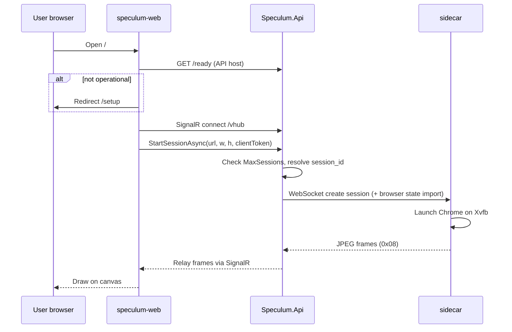

# Architecture

Speculum is a **remote browser isolation** platform. A real Chromium instance runs on the server; end users interact through a low-latency JPEG screencast rendered in a React canvas. The stack is deliberately **domain-agnostic**: Traefik terminates TLS at the edge, and all motor behaviour is configured at runtime through SQLite and the Admin API.

---

## Table of contents

- [Design goals](#design-goals)
- [Logical view](#logical-view)
- [Physical deployment](#physical-deployment)
- [Request and session flows](#request-and-session-flows)
- [Configuration layers](#configuration-layers)
- [Security model](#security-model)
- [Persistence](#persistence)
- [Technology choices](#technology-choices)

---

## Design goals

| Goal | How it is achieved |
|------|-------------------|
| **Isolation** | Browsing happens in server-side Chrome; only pixels and input events cross the wire |
| **Domain flexibility** | No hard-coded target site; `Forwarding` section defines the remote site host and navigation allowlist |
| **Operational clarity** | `/ready` and `/api/admin/config/status` expose whether the motor can start sessions |
| **Split front/back** | React SPA on motor domain; API + SignalR on API subdomain with explicit CORS |
| **Repeatable deploy** | [dockup](../deploy/README.md) generates environment-specific compose stacks |

---

## Logical view

```
┌─────────────────────────────────────────────────────────────────────────────┐
│  End-user browser                                                            │
│    speculum.<domain>  →  React SPA (motor, setup, admin)                    │
└───────────────────────────────┬─────────────────────────────────────────────┘
                                │ HTTPS (REST, static assets)
                                │ WSS + MessagePack (SignalR /vhub)
                                ▼
┌─────────────────────────────────────────────────────────────────────────────┐
│  api.speculum.<domain>  →  Speculum.Api (.NET 10)                           │
│    • BootstrapConfig (env)                                                   │
│    • ISpeculumConfigStore → SQLite runtime sections                          │
│    • VirtualizationHub → session orchestration                               │
│    • VSession → sidecar WebSocket relay                                      │
│    • Admin API + OpenAPI                                                     │
└───────────────────────────────┬─────────────────────────────────────────────┘
                                │ ws://sidecar:3000 (internal Docker network)
                                ▼
┌─────────────────────────────────────────────────────────────────────────────┐
│  sidecar (Node.js + Patchright)                                              │
│    Xvfb → Chrome (non-headless) → CDP screencast → JPEG frames              │
│    Navigation guard, browser state export/import, script injection           │
└─────────────────────────────────────────────────────────────────────────────┘
```

### Component responsibilities

| Layer | Repository path | Responsibility |
|-------|-----------------|----------------|
| **Edge** | Traefik (dockup) | TLS, HTTP→HTTPS redirect, host-based routing |
| **Web** | `web/` | Motor UI, setup wizard, admin panel |
| **API** | `Speculum.Api/` | Sessions, config store, frame relay, admin REST |
| **Sidecar** | `sidecar/` | Chrome lifecycle, input, screencast, browser state export/import |

---

## Physical deployment

Production and development both use **four containers** on a shared Docker network:

| Service | Image | Exposed | Traefik rule |
|---------|-------|---------|--------------|
| `traefik` | `traefik:v3.6.1` | Host ports | Routes by `Host()` label |
| `web` | `speculum-web` | Via Traefik | `TRAEFIK_MOTOR_DOMAIN` |
| `api` | `speculum-api` | Via Traefik | `TRAEFIK_API_DOMAIN` |
| `sidecar` | `speculum-sidecar` | Internal only | — |

**Canonical workflow:** `cd deploy && dockup deploy --env dev|prod --root ..`

See [deploy/README.md](../deploy/README.md) for ports, TLS, and VPS transfer.

### Development vs production

| Aspect | Dev (`dockup --env dev`) | Prod (`dockup --env prod`) |
|--------|--------------------------|----------------------------|
| Traefik ports | `8080` (HTTP) | `80` / `443` |
| TLS | None (plug-and-play) | Let's Encrypt (`ACME_EMAIL`) |
| Motor URL | `http://speculum.localhost:8080` | `https://<TRAEFIK_MOTOR_DOMAIN>` |
| API URL | `http://api.speculum.localhost:8080` | `https://<TRAEFIK_API_DOMAIN>` |
| CORS | Dev origins + `localhost:5173` | Motor origin only |

---

## Request and session flows

### Motor startup (happy path)



### Session identity and URL sync

- The motor stores a **`client_token`** in a cookie (`speculum_client_token`). The API maps it to an internal **`session_id`** (SQLite primary key).
- `StartSessionAsync(clientUrl, w, h, clientToken)` accepts the client token and returns the effective id for the hub connection.
- **URL is never persisted or restored.** Initial navigation uses the client path + query only (`InitialUrlBuilder`).
- On disconnect, browser state (cookies, localStorage, IndexedDB, history) is exported via CDP and stored relationally in SQLite (`browser_sessions` + child tables).
- There is **no HTTP session cookie** for the motor; persistence is client token + server state.

### Motor URL modes

| Mode | Trigger | Client URL bar | Cookie domain |
|------|---------|----------------|---------------|
| **Apex (default)** | `SubdomainMirroring.enabled = false` | Always apex motor host (`speculum.com/path`) | Apex hostname |
| **Subdomain mirroring** | Feature ON **and** operational | Mirrors target subdomains (`www.speculum.com` ↔ `www.olx.com.br`) | `.<motorPublicDomain>` |

Subdomain mirroring is **optional and OFF by default**. When enabled but misconfigured, runtime degrades to apex mode; `/api/admin/config/status` exposes `subdomainMirroring.operational` and `missing`.

When subdomain mirroring is operational, target redirects that change subdomain trigger `window.location.href` on the client (same session via cookie). In apex mode, `MSG_URL` maps redirects to the apex path and uses `history.pushState` without cross-subdomain reload.

### Navigation guard

Runtime `Forwarding.domains` controls **main-frame document** navigation only. Assets, `fetch`, XHR, and sub-frames are not restricted by this list. External main-frame navigation triggers `MSG_REDIRECT (0x0A)` and the client performs `window.location.href` to leave the virtual browser.

Details: [motor-reference.md](motor-reference.md#2-forwarding-model).

---

## Configuration layers

### Layer 1 — Infrastructure (environment)

Required for API boot. Never stored in SQLite.

| Variable | Example | Purpose |
|----------|---------|---------|
| `HttpAddress` | `0.0.0.0:8080` | Kestrel bind |
| `Database__Path` | `/data/speculum.db` | SQLite file |
| `Sidecar__BaseUrl` | `ws://sidecar:3000` | Sidecar WebSocket |
| `Cors__AllowedOrigins` | `http://speculum.localhost:8080;...` | Semicolon-separated SPA origins |
| `Motor__PublicDomain` | `speculum.com` | Public apex of the motor (cookies, CORS, HostMapper) |
| `ASPNETCORE_ENVIRONMENT` | `Development` / `Production` | ASP.NET environment |
| `ADMIN_BOOTSTRAP_KEY` | (optional) | Override first-boot admin API key |

### Layer 2 — Motor runtime (SQLite + Admin API)

| Section | Required | Description |
|---------|----------|-------------|
| `Forwarding` | Yes | `host` (target site FQDN) + `domains` (navigation allowlist) |
| `MaxSessions` | Yes | Concurrent session cap |
| `ScriptInjection` | No | Injected script ids or URLs |
| `SessionPolicy` | No | e.g. `{ "ttlDays": 30 }` (alias: `SnapshotPolicy`) |
| `SubdomainMirroring` | No | `{ "enabled": false, "edgeTls": { ... } }` — opt-in wildcard subdomain mirror |
| `JsBridge` | No | `{ "enable": true \| false }` |

`Forwarding.host` is the site the motor opens (`https://{host}{path}`). It is independent of Traefik motor/API hostnames.

### Layer 3 — Admin credentials (SQLite, seeded once)

On first boot, `Admin.apiKey` is generated randomly (or taken from `ADMIN_BOOTSTRAP_KEY`). The key appears in container logs in Development; Production logs only a prefix. Admin UI stores the key in `sessionStorage` as a Bearer token.

---

## Security model

| Surface | Auth | Notes |
|---------|------|-------|
| `/health`, `/ready` | Public | Liveness / readiness (`/ready` does not require subdomain mirroring) |
| `GET /api/admin/config/status` | Public | Setup UI; includes `subdomainMirroring` status |
| `GET /api/public/client-config` | Public | Motor public domain + subdomain mirroring flag |
| `/vhub` (SignalR) | Public | Edge protection expected from Traefik / network policy |
| `/api/admin/*`, `/openapi/*` | Bearer `Admin.apiKey` | Enforced by `AdminAuthMiddleware` |
| Script URL resolution | SSRF guard | `SsrfGuard` + custom DNS resolver for remote script fetches |

When subdomain mirroring is operational, CORS allows motor apex/subdomains plus bootstrap `Cors__AllowedOrigins` (so Vite dev on `localhost:5173` still works).

Defence in depth: Traefik TLS and network policy are expected at the edge; the API does not authenticate `/vhub` — restrict exposure in production.

---

## Persistence

| Store | Location | Contents |
|-------|----------|----------|
| SQLite | `Database__Path` | `config_sections`, `browser_sessions` (+ cookies/LS/IDB/history tables), injected scripts metadata |
| Docker volume | `speculum-data` | SQLite file + Traefik dynamic config (`/data/traefik/`) in deployed stacks |
| Client | Cookie | `speculum_client_token` (domain depends on subdomain mirroring mode) |
| Client | `sessionStorage` | Admin Bearer token |

Changing `Forwarding` terminates all active sessions.

---

## Technology choices

| Area | Choice | Rationale |
|------|--------|-----------|
| API | .NET 10, SignalR + MessagePack | Strong typing, efficient binary hub protocol |
| Web | React 19, Vite, Tailwind | Modern SPA; canvas motor with Web Worker JPEG decode |
| Sidecar | Patchright (Chromium), Xvfb | Real browser fingerprint; non-headless screencast |
| Config | SQLite | Single-file ops model; no separate config service |
| Deploy | dockup v2 | Declarative multi-env compose generation |

---

## Related documents

- [Motor reference](motor-reference.md) — protocol bytes, config store algorithm, setup mode
- [Deploy guide](../deploy/README.md) — dockup commands, VPS workflow
- [API README](../Speculum.Api/README.md) — project layout and local run
- [Web README](../web/README.md) — routes and environment variables
- [Sidecar README](../sidecar/README.md) — Chrome sidecar internals
