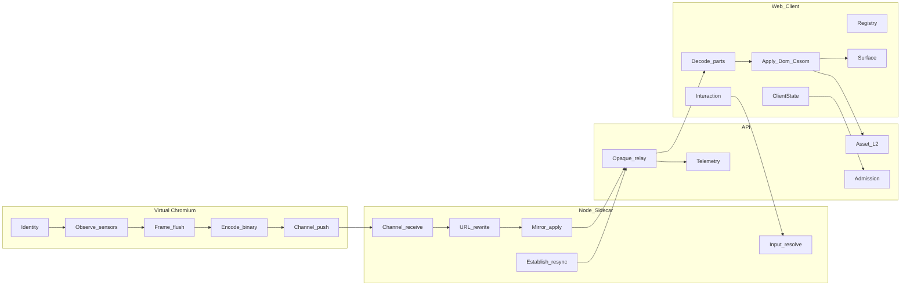

# Contracts — overview (E2E)

**Owner of this doc:** Spec pack.  
**Norm:** redesign §4 target architecture + §5.

## End-to-end data path

## Architectural invariants (MUST)

1. Nothing is written into the Virtual site DOM for identity (no live `speculum-anchor` on Virtual).  
2. Payload for a frame is produced **once** in-page as binary; no `JSON.stringify`/`JSON.parse` of the tree on the frame/establish path.  
3. The **frame** is the unit of coalesce, sequence, wire, apply, and default telemetry.  
4. Projected surface is a real sandboxed document (no `allow-scripts`).  
5. Perception is local; truth is authoritative.

## Contract inventory

| # | File | Redesign |
|---|------|----------|
| 01 | [01-identity.md](01-identity.md) | §5.1 |
| 02 | [02-f-map.md](02-f-map.md) | §5.2, §5.2.1 |
| 03 | [03-frame.md](03-frame.md) | §5.3 |
| 04 | [04-wire.md](04-wire.md) | §5.4, §5.5 |
| 05 | [05-establish.md](05-establish.md) | §5.6 |
| 06 | [06-cssom.md](06-cssom.md) | §5.10 |
| 07 | [07-recovery.md](07-recovery.md) | §5.7 |
| 08 | [08-surface.md](08-surface.md) | §5.8 |
| 09 | [09-apply.md](09-apply.md) | §5.9.1 |
| 10 | [10-interaction.md](10-interaction.md) | §5.9.2–5.9.5, §5.11 |
| 11 | [11-assets.md](11-assets.md) | §5.12 |
| 12 | [12-session-lifecycle.md](12-session-lifecycle.md) | §5.13 |
| 13 | [13-admission.md](13-admission.md) | §5.14 |
| 14 | [14-telemetry.md](14-telemetry.md) | §5.15 |
| 15 | [15-configuration.md](15-configuration.md) | §5.16 |
| 16 | [16-errors.md](16-errors.md) | §5.7.1 + failures |
| 17 | [17-module-map.md](17-module-map.md) | §9 |

## Process owners

| Process | Responsibilities |
|---------|------------------|
| Virtual (in-page) | Identity, observe, sensors, frame accumulate/flush, encode, establish HTML walk, cssom sensors |
| Sidecar (Node) | Channel receive, URL rewrite, mirror, clock watchdog, rate messages, input reverse resolve, resync serialize, pool |
| API (.NET) | Opaque Body relay, L2 cache, admission gate, catalogued telemetry, config |
| Client (web) | Decode/parts, registry, apply, surface double-buffer, local-first interaction, ClientState |

## Shared vocabulary

| Term | Meaning |
|------|---------|
| `generation` | Epoch of id space; bumps only on real top-level Document swap |
| `sequence` | Contiguous frame counter within a generation; empty frames consume none |
| `F` | Structural publish map (placeholders, pierce flatten, deny-list attrs) |
| `armed` | Client may send pointer intents; requires establishEnd + registry verify + cssomInstall |
| `desync` | Client refuses apply of live truth until OOB resync completes |
| `part` | One wire message of a possibly split frame; apply only when all parts assembled |
