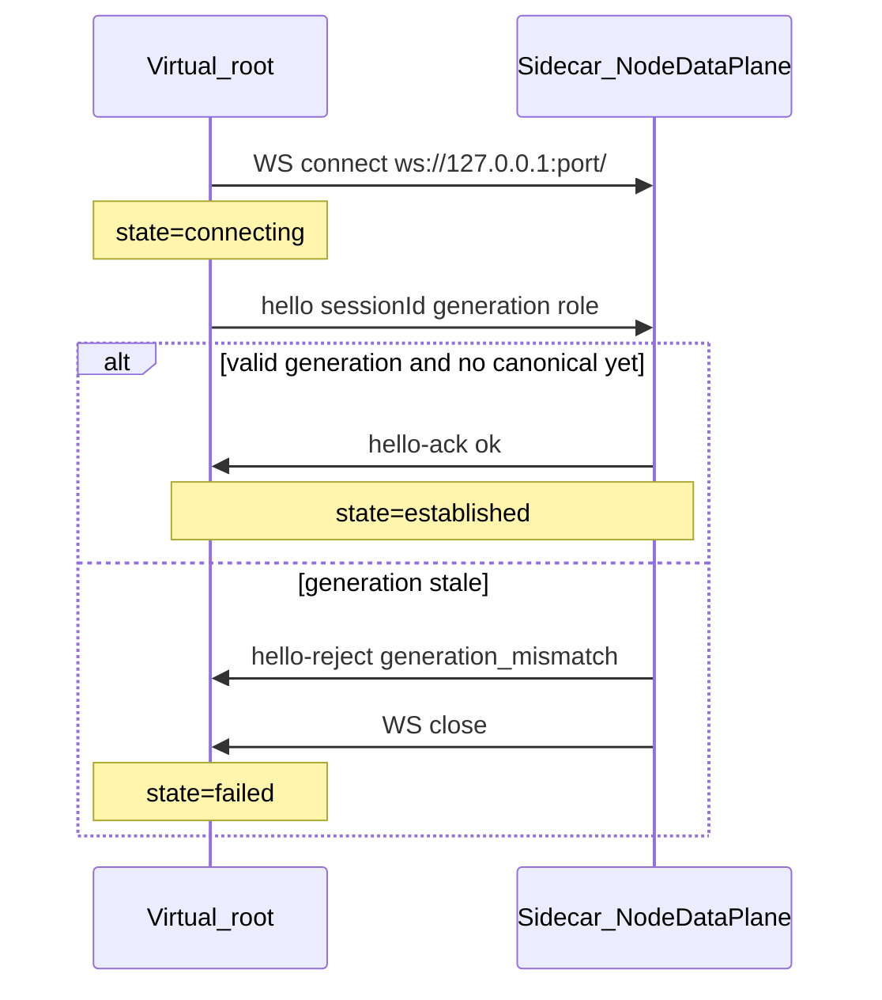

# PageProjection — Loopback data plane (establishment + mux)

**Status:** **SEALED 2026-08-27** (Rodrigo) — normative for Virtual↔sidecar loopback WebSocket **establishment**, health, and mux.  
**Extends:** [input-unified-design-draft.md](input-unified-design-draft.md) §10.1c (LB-01…LB-07, **LOCKED** — envelope kinds for frame/telemetry/invoke).  
**Session law:** [browser-session.md](browser-session.md) — carrier = loopback WebSocket to sidecar (`projectionDataPlane: 'loopback'`). On managed Chrome the **canonical client** is the **Speculum Plane extension** ([extension-plane.md](extension-plane.md)); the page must not open `ws://127.0.0.1`.  
**CSP / LNA:** [csp.md](csp.md) §8 — Document surgery + managed-Chrome LNA policy; **not** site-specific allowlists.  
**Tracker:** [open.md](open.md) **PP-LOOPBACK-ESTABLISH** — **CLOSED 2026-08-27** (handshake + symmetric establish + tests §14).  
**Code (impl map):** `Refactor/packages/page-projection/src/core/loopback/` · `Refactor/sidecar/browser/mirror/projection/session/nodeDataPlane.ts` · `projectionDataPlaneHost.ts` · `Refactor/packages/page-projection/src/virtual/transport/loopbackDataPlane.ts` · `bootstrap.ts`.

---

## 1. Goal

Professional, **symmetric** loopback contract:

1. **One canonical connection** per `(sessionId, generation)` — orphan / ghost WebSocket **impossible by design**.
2. Both sides expose **`await establishConnection()`** — resolves only after application-level handshake, not merely TCP `OPEN`.
3. Both sides share the same **connection health** model (`connecting` → `established` → `closed` / `failed`).
4. Sidecar **does not** accept `invoke`, arm input, or declare navigate complete until **established** for the current generation.
5. Virtual **does not** treat boot as success if establish fails; reconnect is **bounded** and generation-aware.
6. Resilient to document nav churn (202→200, same-tab replacement, epoch bump) without manual lab testing as oracle.

**Accept bar:** no `input_reject … data plane not open` while either side believes the plane is healthy; no desync where Virtual `readyState=OPEN` and Node `isOpen=false`.

---

## 2. Non-goals

- Replacing LB-01…LB-07 mux kinds (`frame`, `telemetry`, `invoke`, …).
- CDP `exposeBinding`, `Runtime.evaluate`, or Patchright isolated-world RPC as carrier (forbidden — E-03/E-08).
- Site-specific LNA URL lists, `LocalNetworkAccessChecks` disable flags, or blunt CSP replace (see [csp.md](csp.md)).
- Virtual→sidecar `invoke` in v0 (unchanged).
- Second tab / second root loopback socket (single-tab law — [browser-session.md](browser-session.md)).

---

## 3. Anti-model (current impl — do not ship)

| Anti-model | Why it breaks |
|------------|----------------|
| `attach(ws)` with `detach(false)` | Node drops reference; browser keeps stale `OPEN`; sidecar and Virtual disagree |
| `whenOpen()` = only WebSocket `open` event | TCP up ≠ session agreed; no generation binding |
| Boot continues after `whenOpen()` failure (`console.error` only) | Virtual runs without usable plane |
| Sidecar `goto()` returns without `await establishConnection()` | Input races nav churn |
| `invoke()` checks `readyState` with no handshake | False positives on ghost sockets |
| Accept every upgrade anonymously | Multiple connections; last-wins without closing predecessors |
| Poll 12s tolerating `data plane not open` in tests | Masks establishment failure |

---

## 4. Identity: session + generation

| Field | Owner | Rule |
|-------|--------|------|
| `sessionId` | Sidecar | Stable for `PageProjectionBrowserSession` lifetime (UUID or monotonic string). Passed to Virtual via `__SPECULUM_PROJECTION__` at inject. |
| `generation` | Sidecar | u32 ≥ 1. Increments on **epoch reset** paths already wired today (`PageProjectionBrowserSession.navigate` close+`freshPage`, config inject). |
| `connectionId` | Sidecar | u32 monotonic per **accepted** canonical socket (diag only). |

**Law LB-08:** Sidecar holds `expectedGeneration`. A loopback peer presenting `hello.generation !== expectedGeneration` is **rejected** (`hello-reject`, socket closed).

**Law LB-09:** At most **one** canonical established socket per `(sessionId, generation)` on the sidecar.

---

## 5. Connection state machine (both sides)

Same semantics on Virtual (`LoopbackDataPlane`) and Node (`NodeDataPlane`):

```text
closed ──open()──► connecting ──hello-ack──► established
   ▲                    │                         │
   │                    ├── timeout / reject ──► failed
   │                    │                         │
   └──── close / generation bump / replace ───────┘
```

| State | Virtual | Sidecar |
|-------|---------|---------|
| `closed` | No socket or fully torn down | No canonical socket |
| `connecting` | WS created; `hello` sent; awaiting `hello-ack` | WS accepted; awaiting valid `hello` |
| `established` | `hello-ack` OK; generation matches | Canonical socket; generation matches |
| `failed` | timeout, reject, or unrecoverable error | same |
| `degraded` | (optional tele) reconnect in progress | optional; invoke may return `not_established` |

**Law LB-10:** `isOpen` (legacy) MUST NOT be used as the product gate. Gate = **`isEstablished`** AND `generation === expectedGeneration`.

Expose on both sides (session/lab diag):

```ts
type LoopbackConnectionStatus = {
  state: 'closed' | 'connecting' | 'established' | 'failed' | 'degraded';
  generation: number;
  sessionId: string;
  lastError?: { code: string; message: string };
};
```

---

## 6. Handshake (application level)

Extends `LoopbackKind` (LB-11). First message from Virtual on a new socket MUST be `hello`. Sidecar MUST NOT treat socket as established until `hello-ack` sent.

### 6.1 Envelope kinds (new)

```ts
| {
    channel: 'speculum.virtual.loopback';
    kind: 'hello';
    sessionId: string;
    generation: number;
    role: 'virtual-root';  // v0: only root opens loopback WS
  }
| {
    channel: 'speculum.virtual.loopback';
    kind: 'hello-ack';
    sessionId: string;
    generation: number;
    ok: true;
  }
| {
    channel: 'speculum.virtual.loopback';
    kind: 'hello-reject';
    sessionId: string;
    generation: number;
    ok: false;
    reason: HelloRejectReason;
  }
```

`HelloRejectReason` (closed enum):

| reason | Meaning |
|--------|---------|
| `generation_mismatch` | `hello.generation !== expectedGeneration` |
| `session_mismatch` | `hello.sessionId !== sessionId` |
| `already_established` | canonical socket already established for this generation |
| `protocol_unsupported` | missing/invalid fields |
| `server_shutting_down` | session dispose in progress |

**Law LB-12:** Until `hello-ack`, sidecar MUST drop/ignore `frame`, `telemetry`, and `invoke-result` on that socket (except it may respond with `hello-reject`).

**Law LB-13:** Virtual MUST NOT send `frame` or handle `invoke` until `hello-ack` received.

### 6.2 Timeouts (LB-14)

| Phase | Default | On expiry |
|-------|---------|-----------|
| TCP + WS `open` | 15s | `failed`, error `ws_open_timeout` |
| `hello` → `hello-ack` | 5s | close socket; `failed`, error `hello_ack_timeout` |
| Sidecar wait after nav (`waitEstablished`) | 20s | navigate fault `data_plane_not_established` + `phase: establish` |

Configurable via session/lab only; no env-var toggles in product path.

### 6.3 Establish sequence



---

## 7. Single canonical socket (sidecar)

**Law LB-15:** On `upgrade`:

1. If an **established** canonical socket exists for `expectedGeneration` → send `hello-reject` (`already_established`) and close the new socket **unless** it is a deliberate replace (see §7.1).
2. If a **connecting** or **established** socket exists for an **older** generation → **close predecessor server-side** (`detach(true)`), then accept new handshake.
3. On successful `hello-ack`, register socket as **canonical** for `(sessionId, generation)`.

### 7.1 Replace without ghost

When attaching a new canonical socket:

- Close previous server-side WebSocket with WebSocket close code **4000** (private use: `generation_superseded`) and reason string `speculum:generation_superseded`.
- Predecessor's `close` handler MUST NOT clear canonical if `this.socket !== predecessor` (already implemented pattern).

Virtual on `close`:

- If `generation` still equals config generation and close was not intentional local `close()` → enter **`degraded`**, schedule reconnect with backoff (§8).
- If generation bumped locally or via config re-inject → stay `closed`; new boot establishes fresh.

---

## 8. Resilience

### 8.1 Virtual reconnect (LB-16)

On unexpected `close` while `generation` still valid:

| Attempt | Backoff |
|---------|---------|
| 1 | 50ms |
| 2 | 100ms |
| 3 | 200ms |
| 4+ | fail closed (`failed`); tele + session fault |

Each attempt: full `establishConnection()` (TCP + hello), not bare `open()`.

**Law LB-17:** Reconnect MUST NOT run concurrently (mutex on Virtual root loopback).

### 8.2 Sidecar after navigation / doc churn

After `page.goto` completes (domcontentloaded) OR same-tab document replacement detected:

```ts
await dataPlane.waitEstablished({ generation: expectedGeneration, timeoutMs: 20_000 });
```

Failure → catalogued fault:

```ts
{ errorCode: 'data_plane_not_established', phase: 'establish', message: '...' }
```

**Law LB-18:** `measureApplyScrollSet` / input arm / lab `armed=true` only when sidecar reports `established` for current generation.

### 8.3 Generation bump

When sidecar increments `generation`:

1. Set `expectedGeneration`.
2. Close canonical socket with `generation_superseded`.
3. Virtual re-boot (existing inject path) opens new WS with new `hello`.
4. Sidecar awaits establish for new generation before accepting invokes.

---

## 9. Public API (both sides)

### 9.1 Virtual — `LoopbackDataPlane`

```ts
establishConnection(opts?: { timeoutMs?: number }): Promise<void>;
// Replaces bare whenOpen() as product gate. whenOpen() may remain internal.

readonly status: LoopbackConnectionStatus;
readonly isEstablished: boolean;

onStatusChange?(cb: (s: LoopbackConnectionStatus) => void): void;
```

Bootstrap root path:

```ts
await loopback.establishConnection();
// on failure: throw — do NOT log-and-continue
```

### 9.2 Sidecar — `NodeDataPlane` / `ProjectionDataPlaneHost`

```ts
waitEstablished(opts: { generation: number; timeoutMs?: number }): Promise<void>;

readonly status: LoopbackConnectionStatus;
readonly isEstablished: boolean;

invoke(...): // LB-04 unchanged, but rejects with not_established if !isEstablished
```

Session:

```ts
// PageProjectionBrowserSession.navigate — after goto:
await this.dataPlane.waitEstablished({ generation: this.generation });
```

---

## 10. Mux after establish (unchanged)

Once **established**, LB-01…LB-07 apply unchanged:

| ID | Rule |
|----|------|
| LB-01 | Channel = `speculum.virtual.loopback` |
| LB-02 | Frame = `bytes` only |
| LB-03 | Invoke names = closed catalog ([input.md](input.md)) |
| LB-04 | Invoke idle 2000ms; heartbeats reset |
| LB-05 | correlationId u32 monotonic |
| LB-06 | Wire = JSON UTF-8 on binary WebSocket frames (see `envelope.ts`) |
| LB-07 | PlaneChannel mapped to kinds |

New handshake kinds are **establishment plane only**; they do not carry DOM/frame payload.

---

## 11. LNA (managed Chrome — generic)

Loopback URL is always `ws://127.0.0.1:<port>/` on the sidecar host.

**Law LB-19a (primary):** On managed Chromium, Virtual root reaches the loopback URL via the **extension plane** ([extension-plane.md](extension-plane.md)) — the page never opens the WebSocket. This bypasses page LNA/CSP without site allowlists.

**Law LB-19b (defense-in-depth):** Enterprise LNA policy remains installed (does not authorize page-origin plane sockets):

- [`Refactor/sidecar/chrome-policies/managed/speculum-lna.json`](../../../Refactor/sidecar/chrome-policies/managed/speculum-lna.json)
- `LoopbackNetworkAllowedForUrls: ["*"]`
- `LocalNetworkAccessAllowedForUrls: ["*"]`

**Forbidden:** per-site hostname entries in policy; `LocalNetworkAccessChecks` in `buildChromeArgs`; `--disable-features` LNA punch ([csp.md](csp.md) §8).

Policy delivery: [`docker-entrypoint.sh`](../../../Refactor/sidecar/docker-entrypoint.sh) → `/etc/opt/chrome/policies/managed/`.

**Proof:** generic diag — HTTPS origin → loopback WS without `ERR_BLOCKED_BY_LOCAL_NETWORK_ACCESS_CHECKS` (any fixture origin; Binance is stress only).

---

## 12. Observability

| Signal | Where |
|--------|--------|
| `Loopback.Established` | catalogued tele (generation, sessionId, wallMs) |
| `Loopback.EstablishFailed` | reason + phase |
| `Loopback.ReconnectAttempt` | attempt #, backoffMs |
| `Loopback.GenerationSuperseded` | oldGen, newGen |
| Lab Debug tab | mirror `status.state`, `generation`, `lastError` |
| `SPECULUM_DIAG_CSP=1` | optional stderr `[speculum-loopback-diag]` (establish only; not a product gate) |

**Law:** Never declare plane OK from `readyState` alone in tests — assert `isEstablished` both sides + successful `applyScrollSet` invoke.

---

## 13. Implementation map

| Piece | File | Change |
|-------|------|--------|
| Envelope kinds | `core/loopback/envelope.ts` | `hello`, `hello-ack`, `hello-reject` |
| Virtual transport | `virtual/transport/loopbackDataPlane.ts` | state machine, establish, reconnect |
| Sidecar transport | `session/nodeDataPlane.ts` | handshake, canonical socket, `detach(true)` |
| Host upgrade | `session/projectionDataPlaneHost.ts` | pass sessionId; reject anonymous |
| Config inject | `inject/buildConfigPreScript.ts` | `sessionId` in `__SPECULUM_PROJECTION__` |
| Session | `PageProjectionBrowserSession.ts` | sessionId, `waitEstablished` after goto |
| Bootstrap | `virtual/bootstrap.ts` | `await establishConnection()`; fail boot |
| Extension carrier | `extension-plane.md`, `extensions/speculum-plane/`, `extensionPlaneSocket.ts` | byte tunnel; LB-08…19 on Virtual unchanged |
| Tests | `nodeDataPlane.unit.ts`, `pageProjectionSession.unit.ts`, `extensionPlane/envelope.unit.ts` | §14 |

---

## 14. Test matrix (required before close PP-LOOPBACK-ESTABLISH)

| Test | Proves |
|------|--------|
| `nodeDataPlane.unit` — replace closes predecessor | LB-15, no ghost |
| `nodeDataPlane.unit` — hello handshake | LB-11…13 |
| `nodeDataPlane.unit` — generation_mismatch reject | LB-08 |
| `nodeDataPlane.unit` — stale close doesn't kill successor | close handler guard |
| `pageProjectionSession.unit` — nav churn fixture | establish after 202→200 + huge body |
| `pageProjectionSession.unit` — desync oracle | if Virtual established ≠ Node → **fail** (not poll) |
| `chromeLnaPolicy.unit` — static | policy `*`, no LNA disable flag |
| `diag-binance-live-plane.js` (Docker) | stress; `nodePlaneOpen === runtimeEstablished` + scroll invoke |

Remove soft-pass: tests MUST NOT treat `data plane not open` as transient success unless explicitly testing reconnect window with timed assert.

---

## 15. Decision log (this file)

| Date | Decision |
|------|----------|
| 2026-08-27 | **Loopback establishment SEALED** — handshake + generation + symmetric `establishConnection` / `waitEstablished`; ghost socket forbidden; extends LB-01…07; impl tracked as PP-LOOPBACK-ESTABLISH. |
| 2026-08-27 | **LB-08…LB-19** locked (see §4–§11). |
| 2026-08-27 | **LNA policy-only** — generic `["*"]`; no site lists; no launch disable flag. |

---

## 16. Related

- Mux invoke catalog: [input.md](input.md) · [input-unified-design-draft.md](input-unified-design-draft.md) §10.1c  
- Session single-tab: [browser-session.md](browser-session.md)  
- CSP connect-src surgery: [csp.md](csp.md)  
- Open tracker: [open.md](open.md) PP-LOOPBACK-ESTABLISH  
